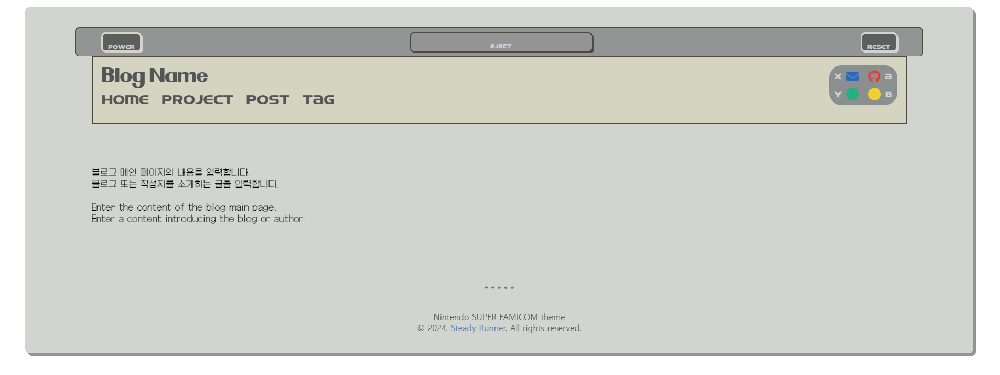
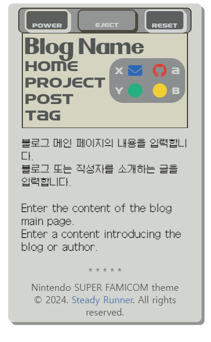

# SUPER FAMICOM blog theme
이 블로그 테마는 현재 정적 웹사이트로 운영되고 있는 저의 개인 블로그를<br />
동적으로 운영하기 위한 목적으로 제작되었습니다.

Vue3 vite 프로젝트로 작성되었으며 UI 템플릿과 네비게이션만 적용된 상태입니다.<br />
어느 정도 반응형을 고려하여 작성되었으며 <br />
VueJS를 기반으로 커스터마이징이 가능합니다.

---

## 테마 UI



<br />

---
---

<br />

This template should help get you started developing with Vue 3 in Vite.

## Recommended IDE Setup

[VSCode](https://code.visualstudio.com/) + [Volar](https://marketplace.visualstudio.com/items?itemName=Vue.volar) (and disable Vetur).

## Type Support for `.vue` Imports in TS

TypeScript cannot handle type information for `.vue` imports by default, so we replace the `tsc` CLI with `vue-tsc` for type checking. In editors, we need [Volar](https://marketplace.visualstudio.com/items?itemName=Vue.volar) to make the TypeScript language service aware of `.vue` types.

## Customize configuration

See [Vite Configuration Reference](https://vitejs.dev/config/).

## Project Setup

```sh
npm install
```

### Compile and Hot-Reload for Development

```sh
npm run dev
```

### Type-Check, Compile and Minify for Production

```sh
npm run build
```
